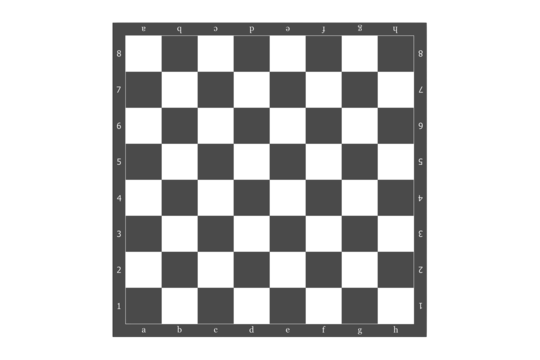
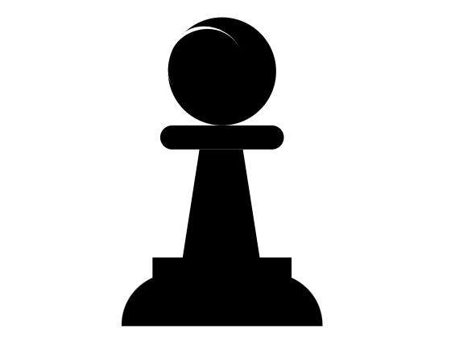
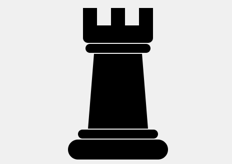

# ♟️ Chess Pieces Designs

A collection of HTML, CSS designs for chess components.

## 🎯 Goal

This repository is for designing each part of a chess game (board + pieces) using only **HTML**, **CSS**.

---

## 🧩 Components

- ✅ **Chessboard** — Completed
- ✅ **Pawn** — Completed
- ✅ **Rook** — Completed
- ♘ **Knight** — In progress
- ♗ **Bishop** — Coming soon
- ♕ **Queen**
- ♔ **King**

| 🧩 Piece       | 🖼️ Preview                                         | 💻 Code                   | 🌐 Live Demo                                                               |
| -------------- | -------------------------------------------------- | ------------------------- | -------------------------------------------------------------------------- |
| **Chessboard** |  | [View Code](./chessboard) | [Live Demo](https://ibraheamit.github.io/chess-pieces-designs/chessboard/) |
| **Pawn**       |                    | [View Code](./pawn)       | [Live Demo](https://ibraheamit.github.io/chess-pieces-designs/pawn/)       |
| **Rook**       |                    | [View Code](./rook)       | [Live Demo](https://ibraheamit.github.io/chess-pieces-designs/rook/)       |

---

🧠 **Made by [Ibrahim Abdullah](https://github.com/ibraheamit)**
